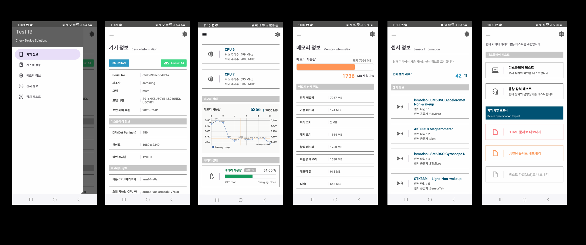
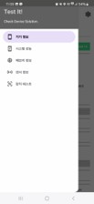

# 📌 프로젝트명 : Test it!

> 안드로이드 기기를 위한 스펙 체크 앱
 
`플레이 스토어 URL` : https://play.google.com/store/apps/details?id=kr.co.devicechecker


## 📂 프로젝트 개요

- **개발 기간**: 2024. 01. 18. ~ 2024. 02. 17. (31 일)
- **개발 인원**: 개인 프로젝트 (1인)


## 🛠️ 기술 스택

```
Kotlin, Timber, Gson, Play In-App Update, Google AD mob, OSS Licenses Plugin, Tedpermission(ParkSangGwon)
```

## ✨ 주요 기능

| 기능 구분             | 설명 |
|----------------------|------|
| 기기 정보 확인       | 기기 일련번호를 포함한 30종 이상의 상세 정보 확인 |
| 시스템 성능 모니터링 | CPU 코어 수 및 클록 주파수, 실시간 메모리 사용량 추적 기능 제공 |
| 메모리 정보 조회     | RAM 용량, 저장소 크기, 저장소 내 파일 목록 등 상세 정보 확인 |
| 센서 정보 확인       | 장착된 센서의 종류, 개수, 공급자 등 센서 관련 정보 조회 |
| 장치 테스트 및 리포트 | 디스플레이, 음향 장치 등 주요 하드웨어 테스트 및 결과 보고서 내보내기 기능 지원 |




## 🖼️ 앱 구현 화면

| 앱 화면 | 캡쳐 이미지 | 앱 화면 | 캡쳐 이미지 |
|------------|-------------|-------------|-------------|
| 홈 메뉴 화면 |  | 기기 정보 화면 |  |
| 시스템 성능 화면 |  | 메모리 정보 화면 |  |
| 센서 정보 화면 |  | 장치 테스트 화면 |  |


## ⚙️ 기술적 배경 및 개선 방향 (AS-IS / TO-BE)

`AS-IS`
- 다양한 안드로이드 기기에서 쉽고 편하게 사양을 확인하기 위한 도구 필요
- 기기 정보 공유나 기록이 필요한 경우, 스크린 캡처나 수기로 작성하는 불편 해소
- 확인한 정보를 다른 프로그램에서 활용할 수 있도록 확장성 제고

`TO-BE`
- Android 기기의 다양한 하드웨어 장치를 하나의 앱에서 간편하게 확인할 수 있도록 Test It 앱 개발.
- 앱 내 정보를 다양한 포맷(TXT, HTML, JSON)으로 저장할 수 있도록 구현 → 외부 호환성과 확장성 확보.
- HTML 출력 문서는 자동차 진단용 리포트 스타일을 참고하여 시각적으로 간결하고 읽기 쉽게 구성.
- 구글 플레이 스토어에 실제 배포하여 설치 가능 → 사용자 피드백 및 실사용 경험 확보 준비 완료.

